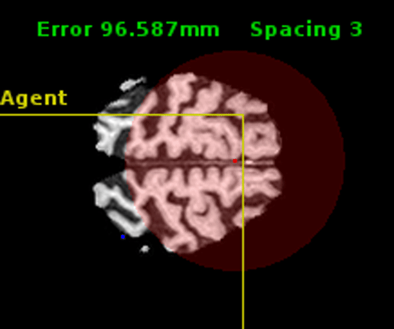

# Anatomical Landmark Detection

Automatic detection of anatomical landmarks is an important step for a wide range of applications in medical image analysis. In this project, we formulate the landmark detection problem as a sequential decision process navigating in a medical image environment towards the target landmark. We deploy multiple Deep Q-Network (DQN) based architectures to train agents that can learn to identify the optimal path to the point of interest. This code also supports both fixed- and multi-scale search strategies with hierarchical action steps in a coarse-to-fine manner.

<p align="center">


</p>

---
## Results

[](videos/cardiac_apex.mp4)

[](videos/brain_ac.mp4)

[](videos/fetal_csp.mp4)

---

## Usage

### Train
```
python DQN.py --algo DQN --gpu 0
```

### Test
```
python DQN.py --algo DQN --gpu 0 --task play --load path_to_trained_model
```

## Citation

If you use this code in your research, please cite this paper:

```
@article{alansary2018evaluating,
    title={{Evaluating Reinforcement Learning Agents for Anatomical
      Landmark Detection}},
    author={Alansary, Amir and Oktay, Ozan and Yuanwei, Li and
      Le Folgoc, Loic and Hou, Benjamin and Vaillant, Ghislain and
      Glocker, Ben and Kainz, Bernhard and Rueckert, Daniel},
    url={https://openreview.net/forum?id=SyQK4-nsz},
    year={2018}
 }
 ```
